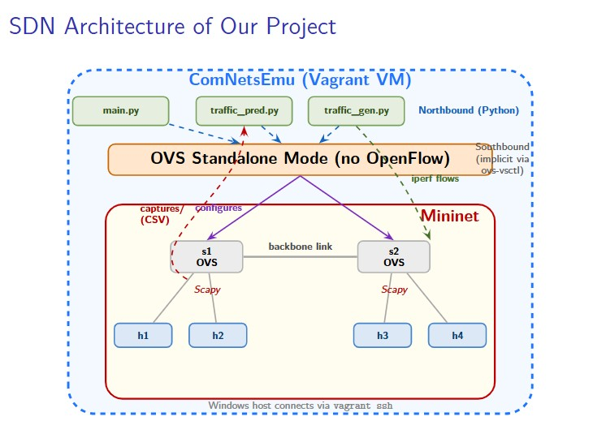
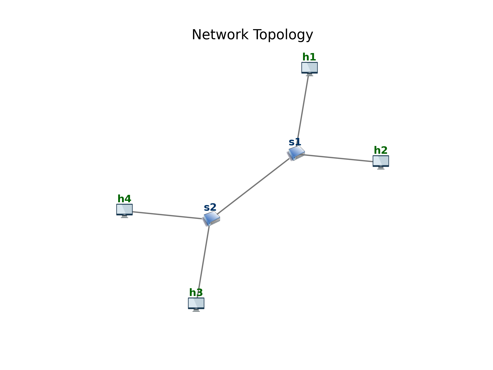

# Traffic Prediction in Software-Defined Networks

**Student:** Yohannes Zewodie
**Course:** Networking II 
**University:** University of Trento

---

## Overview

This project aims to analyse traffic patterns and predict future bandwidth in a Software-Defined Network (SDN) environment. A virtual network is built inside ComNetsEmu using Mininet and Open vSwitch. Structured intermittent traffic is generated between hosts using iperf, captured per switch interface using Scapy, and fed into an **ARIMA** time series forecasting model to predict future traffic. Prophet (Meta) is also evaluated as a comparison.

The performance analysis involves running traffic flows for 120 seconds, with 75% of the captured data used for ARIMA training and 25% as a blind test window.

---

## Implementation Pipeline


The pipeline runs in six steps — network initialisation, traffic generation, packet capture, data preprocessing, model training, and traffic prediction — each of which is described in detail in the sections below.

---
## SDN Architecture



Everything runs inside ComNetsEmu (Vagrant VM). The Python scripts form the **Northbound Interface** — they control the network programmatically. OVS switches run in **standalone mode** (no live OpenFlow controller), with the southbound interface handled implicitly by Mininet's `ovs-vsctl` configuration at startup.


## Network Topology



| Component | Value |
|-----------|-------|
| Switches | 2 (s1, s2) |
| Hosts per switch | 2 (h1, h2 on s1 — h3, h4 on s2) |
| Backbone link | s1 ↔ s2 |
| Protocol | STP enabled, OVS standalone |
| Captured interfaces | s1/eth1, eth2, eth3 — s2/eth1, eth2, eth3 |

---

## Project Structure

```
.
├── main.py                       # Orchestrator — topology, traffic, capture
├── traffic_prediction.py         # ARIMA prediction pipeline
├── prophet_prediction.py         # Prophet prediction pipeline (comparison)
├── utils/
│   └── traffic_generation.py     # ON/OFF iperf traffic generator per host
├── captures/                     # CSV packet logs (auto-generated at runtime)
│   ├── s1/
│   │   ├── eth1.csv
│   │   ├── eth2.csv
│   │   └── eth3.csv
│   └── s2/
│       ├── eth1.csv
│       ├── eth2.csv
│       └── eth3.csv
├── plots/                        # ARIMA prediction plots (auto-generated)
├── plots_prophet/                # Prophet prediction plots (auto-generated)
├── images/
│   └── Archi.png                 # SDN architecture diagram
├── topology_image.png            # Network topology diagram (auto-generated)
├── sdn_traffic_prediction.ipynb  # Jupyter notebook demo
├── requirements.txt
└── README.md
```

---

## Requirements

Mininet and OVS are included in ComNetsEmu. Follow the setup instructions on [Prof. Fabrizio Granelli's website](https://www.granelli-lab.org/researches/relevant-projects/comnetsemu-labs).

- **ComNetsEmu** (Vagrant VM) — [https://github.com/stevelorenz/comnetsemu](https://github.com/stevelorenz/comnetsemu)
- **Python 3.8+**
- **iperf** (included in ComNetsEmu)

Install Python dependencies:

```bash
sudo pip3 install -r requirements.txt
```

For Prophet (optional — comparison only):

```bash
pip install prophet --break-system-packages
```

---

## Getting Started

Clone the repository:

```bash
git clone https://github.com/YohannesZewodie/sdn-traffic-prediction
cd sdn-traffic-prediction
```

---

## Usage

### Step 1 — Start ComNetsEmu

```bash
vagrant up
vagrant ssh
cd /home/vagrant/comnetsemu/SDNfiles
```

### Step 2 — Install dependencies

```bash
sudo pip3 install -r requirements.txt
```

### Step 3 — Generate traffic and capture packets

```bash
# Clean any previous Mininet state
sudo mn -c

# Run the experiment (120 seconds)
sudo python3 main.py --switches 2 --hosts 2 --time 120 --base-flows 2 --flows 2
```

Application flow inside `main.py`:
1. **Network creation** — builds the specified topology using Mininet
2. **STP configuration** — waits for Spanning Tree Protocol to converge (~30s)
3. **Ping test** — verifies connectivity between all hosts
4. **Traffic generation** — starts continuous base flows and periodic ON/OFF flows
5. **Traffic capture** — Scapy AsyncSniffer records every packet per interface to CSV

### Step 4 — Run ARIMA prediction

```bash
python3 traffic_prediction.py --csv captures --store-plot plots --sample-period "1S" --order 30,0,0 --training-split 0.75
```

### Step 5 — Copy plots to Windows host (optional)

```bash
cp plots/*.png /vagrant/
```

### Step 6 — Run Prophet comparison (optional)

```bash
python3 prophet_prediction.py --csv captures --store-plot plots_prophet --sample-period "1S" --training-split 0.75
```

---

## Parameters

### main.py

| Parameter | Default | Description |
|-----------|---------|-------------|
| `--switches` | 2 | Number of switches |
| `--hosts` | 2 | Hosts per switch |
| `--cross-connection` | 0.30 | Cross-link probability between non-adjacent switches |
| `--time` | 120 | Experiment duration (seconds) |
| `--base-flows` | 2 | Always-on continuous iperf flows |
| `--flows` | 2 | Periodic ON/OFF flows per host |

### traffic_prediction.py

| Parameter | Default | Description |
|-----------|---------|-------------|
| `--csv` | captures | Folder containing CSV files |
| `--store-plot` | plots | Folder to save prediction plots |
| `--sample-period` | 1S | Resample bin width (pandas format) |
| `--order` | 30,0,0 | ARIMA(p,d,q) order |
| `--training-split` | 0.75 | Fraction used for training |

### prophet_prediction.py

| Parameter | Default | Description |
|-----------|---------|-------------|
| `--csv` | captures | Folder containing CSV files |
| `--store-plot` | plots_prophet | Folder to save prediction plots |
| `--sample-period` | 1S | Resample bin width |
| `--training-split` | 0.75 | Fraction used for training |

---

## Traffic Generation Pattern

Traffic generation uses two types of iperf flows running simultaneously:

```
Continuous flows (--base-flows 2):
  Always-on iperf streams — provide a stable non-zero baseline

Periodic flows (--flows 2):
  Cycle 1:  ████████████  0.7 Mbps  |  silence (1s)
  Cycle 2:  ████████████  0.4 Mbps  |  silence (1s)
  Cycle 3:  ████████████  0.9 Mbps  |  silence (1s)
            ←── 5s ────→  ←─ 1s ──→
  BW is random each cycle: 0.2 – 1.0 Mbps
```

The continuous flows keep the series non-zero during OFF phases. The periodic flows create the learnable ON/OFF autocorrelation structure that ARIMA exploits.

---

## ARIMA Model

The model used is **ARIMA(30, 0, 0)** — a pure autoregressive model:

```
ŷ_t = c + φ₁y_{t-1} + φ₂y_{t-2} + ... + φ₃₀y_{t-30} + ε_t
```

| Parameter | Value | Reason |
|-----------|-------|--------|
| p = 30 | AR order | ON/OFF cycle = 6s → p = 5 × 6 = 5 full cycles of history |
| d = 0 | No differencing | ADF test confirmed stationarity (p-value < 0.05) |
| q = 0 | No MA term | ACF plot showed no significant lags beyond AR |

Weights φ₁...φ₃₀ are estimated using **Maximum Likelihood Estimation (MLE)**, which finds the weights that maximise the probability of observing the training data — equivalent to minimising the sum of squared prediction errors.

---

## Results

Experiment: `--switches 2 --hosts 2 --time 120 --base-flows 2 --flows 2`

| Switch | Interface | MAE (Mbps) | RMSE (Mbps) |
|--------|-----------|------------|-------------|
| s1 | eth1 | 0.5731 | 0.6794 |
| s1 | eth2 | 0.6439 | 0.7639 |
| s1 | eth3 | 0.6389 | 0.7239 |
| s2 | eth1 | 0.6447 | 0.7578 |
| s2 | eth2 | 0.5001 | 0.6059 |
| s2 | **eth3** | **0.2046** | **0.2490** |
| | **Average** | **0.5342** | **0.6300** |

The best result (s2/eth3 MAE = 0.2046 Mbps) is on a host-facing interface with lower traffic variance. The backbone interfaces (eth1) show higher error due to aggregated traffic from multiple overlapping flows.

---

## Why ARIMA over Prophet?

Prophet was evaluated on the same captures but produced a flat forecast because:

- Prophet is designed for long datasets with **weekly and yearly seasonality**
- Our experiment is only 120 seconds — far too short for seasonality detection
- With insufficient data, Prophet falls back to extrapolating a slight downward trend

ARIMA(30,0,0) is better suited for short autocorrelated series like structured 120-second network traffic captures.

---

## Jupyter Notebook

An interactive demo notebook walks through the full pipeline step by step:

```bash
pip install jupyter --break-system-packages
jupyter notebook sdn_traffic_prediction.ipynb
```


---

## Acknowledgements

- [ARIMA — statsmodels](https://www.statsmodels.org)
- [Prophet — Meta](https://facebook.github.io/prophet/)
- [ComNetsEmu](https://git.comnets.net/public-repo/comnetsemu)
- [Prof. Fabrizio Granelli's lab](https://www.granelli-lab.org)

---

## License

This project was developed as a university coursework assignment at the University of Trento.
